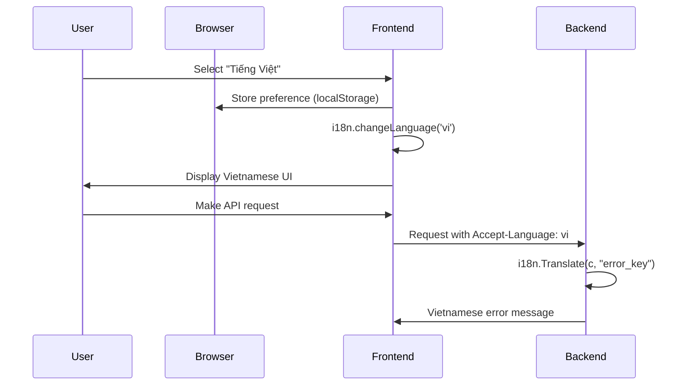

# Vietnamese i18n - Technical Design

## Architecture

Follow existing i18n pattern in Default theme. Extend to Berry and Air themes.

## Current State

| Layer | i18n Status | Reference |
|-------|-------------|-----------|
| Backend | Partial (3 keys) | `common/i18n/locales/{en,zh-CN}.json` |
| Default theme | ✅ Full (~800 keys) | `web/default/src/i18n.js`, `locales/{zh,en}/` |
| Berry theme | ❌ Hardcoded Chinese | `web/berry/src/menu-items/panel.js:25-100` |
| Air theme | ❌ Hardcoded Chinese | `web/air/src/components/*.js` |

## Implementation Approach

### Phase 1: Backend - Add Vietnamese

**Files to create**:
- `common/i18n/locales/vi.json`

**Files to modify**:
- `middleware/language.go:11-24` - Add Vietnamese detection

```go
// Add to language detection logic
if strings.HasPrefix(strings.ToLower(lang), "vi") {
    lang = "vi"
}
```

### Phase 2: Default Theme - Add Vietnamese

**Files to create**:
- `web/default/src/locales/vi/translation.json` - Copy from zh, translate

**Files to modify**:
- `web/default/src/i18n.js:4-25` - Add vi import and resource
- `web/default/src/components/Header.js:142-145` - Add vi to languageOptions

### Phase 3: Berry Theme - Implement Full i18n

**Dependencies to install**:
```bash
cd web/berry && npm install i18next react-i18next i18next-browser-languagedetector
```

**Files to create**:
- `web/berry/src/i18n.js` - Follow pattern: `web/default/src/i18n.js`
- `web/berry/src/locales/zh/translation.json`
- `web/berry/src/locales/en/translation.json`
- `web/berry/src/locales/vi/translation.json`

**Files to modify**:
- `web/berry/src/index.js:1-26` - Import i18n
- `web/berry/src/App.js` - No change needed
- `web/berry/src/menu-items/panel.js` - Use t() for titles
- `web/berry/src/layout/MainLayout/Header/` - Add language switcher
- `web/berry/src/views/**/*.js` - Replace hardcoded text with t()

### Phase 4: Air Theme - Implement Full i18n

**Dependencies to install**:
```bash
cd web/air && npm install i18next react-i18next i18next-browser-languagedetector
```

**Files to create**:
- `web/air/src/i18n.js` - Follow pattern: `web/default/src/i18n.js`
- `web/air/src/locales/zh/translation.json`
- `web/air/src/locales/en/translation.json`
- `web/air/src/locales/vi/translation.json`

**Files to modify**:
- `web/air/src/index.js` - Import i18n
- `web/air/src/components/HeaderBar.js` - Add language switcher
- `web/air/src/components/*.js` - Replace hardcoded text with t()
- `web/air/src/pages/**/*.js` - Replace hardcoded text with t()

## Component Changes

### Language Switcher (Berry/Air)

```javascript
// Pattern from Default theme: web/default/src/components/Header.js:142-149
const languageOptions = [
  { key: 'zh', text: '中文', value: 'zh' },
  { key: 'en', text: 'English', value: 'en' },
  { key: 'vi', text: 'Tiếng Việt', value: 'vi' },
];
```

### Translation Usage Pattern

```javascript
import { useTranslation } from 'react-i18next';

function Component() {
  const { t } = useTranslation();
  return <span>{t('menu.dashboard')}</span>;
}
```

## Translation Key Structure

```json
{
  "menu": {
    "dashboard": "Tổng quan",
    "channel": "Kênh",
    "token": "Token",
    "log": "Nhật ký",
    "redemption": "Đổi mã",
    "topup": "Nạp tiền",
    "user": "Người dùng",
    "profile": "Hồ sơ",
    "setting": "Cài đặt"
  },
  "common": {
    "submit": "Gửi",
    "cancel": "Hủy",
    "save": "Lưu",
    "delete": "Xóa",
    "edit": "Sửa",
    "search": "Tìm kiếm"
  }
}
```

## Error Handling

| Error Case | Response |
|------------|----------|
| Missing translation key | Fallback to English, then show key |
| Invalid language code | Default to Chinese (zh) |
| Translation file load failure | Log error, use fallback language |

## Key Flows



## Files Summary

| Action | Count | Files |
|--------|-------|-------|
| Create | 11 | vi.json (backend), translation.json x10 (3 themes x 3 langs + 1 vi for default) |
| Modify | ~100+ | middleware, i18n configs, all UI components with hardcoded text |

